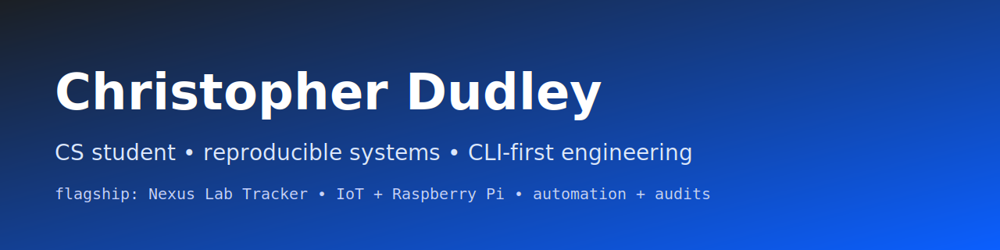

## What I build
I’m Christopher — a Computer Science student focused on **reproducible, automation-first systems**.
I like projects that are deterministic, easy to run, and designed for **auditability**.

## Start here
- **Flagship:** Nexus Lab Tracker → https://github.com/chrisdudley-dev/nexus-lab-tracker
- **IoT:** Smart Edge Cloud Thermohygrometer → https://github.com/chrisdudley-dev/smart-edge-cloud-thermohygrometer

## Featured work
- **Nexus Lab Tracker** — deterministic CLI→API workflows + reproducible snapshots  
  https://github.com/chrisdudley-dev/nexus-lab-tracker
- **Smart Edge-to-Cloud Thermohygrometer** — Raspberry Pi IoT monitoring + AWS  
  https://github.com/chrisdudley-dev/smart-edge-cloud-thermohygrometer

## Engineering principles I care about
- Deterministic scripts and repeatable setup
- Logging + verification for backups/exports
- Security-minded defaults (no secrets committed)

## Contact
- chrisdudley.dev@gmail.com
